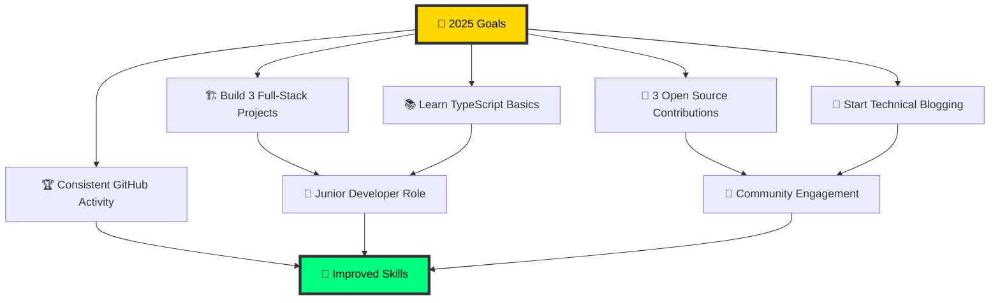

# 👋 Hi there, I'm Rupesh Kumar Sah!

<div align="center">
  <h1>
    
  </h1>
</div>

<div align="center">
  <h3>🚀 Full-Stack Developer | 🎓 B.Tech Student | 💡 Problem Solver</h3>
  
</div>

<br>

<div align="center">
  
</div>

<br>

<div align="center">
  
  
  
  <a href="https://github.com/Rupesh3170?tab=repositories&sort=stargazers">
    </a>
</div>

<br>

<p align="center">
  
</p>

---

## 🚀 About Me


```javascript
const rupesh = {
    pronouns: "He/Him",
    location: "India 🇮🇳",
    education: "B.Tech Computer Science",
    currentFocus: "Full-Stack Development",
    passion: "Creating amazing digital experiences ✨",
    technologies: {
        frontEnd: ["React", "HTML5", "CSS3", "JavaScript", "Redux"],
        backEnd: ["Node.js", "Express.js", "RESTful APIs"],
        databases: ["MongoDB", "Mongoose", "Firebase"],
        tools: ["Git", "VS Code", "Postman", "Vercel", "Netlify"],
        currentlyLearning: ["TypeScript", "Next.js", "Docker", "AWS"],
        futureGoals: ["GraphQL", "React Native", "Kubernetes"]
    },
    funFact: "I debug with console.log() and I'm not ashamed! 😄",
    motto: "Code like Messi plays football - with passion and precision! ⚽🔥"
};
```

<br clear="right"/>

<p align="center">
  
  <br>
  <em>"Scoring goals in code like Messi on the field! 🥅💻"</em>
</p>

---

## 📊 GitHub Statistics

<div align="center">
  
  
</div>

<div align="center">
  

</div>

---

## 🏆 GitHub Trophies & Achievements

<div align="center">
  
</div>


<div align="center">
  
  <br>
  <em>"Every commit is a step closer to the goal! 🎯"</em>
</div>

---

## 📈 Activity Graph & Contributions

<div align="center">
  
</div>

<div align="center">
  
</div>

---

## 🛠️ Tech Stack & Tools

### 💻 Programming Languages
<div align="center">
  
  <br>
  
  
  
  
</div>

### 🚀 Frontend Technologies  
<div align="center">
  
  <br>
  
  
  
  
  
</div>

### ⚙️ Backend & APIs
<div align="center">
  
  <br>
  
  
  
  
</div>

### 🔧 Development Tools & Platforms
<div align="center">
  
  <br>
  
  
  
  
  
  
  
</div>

### 📚 Currently Learning
<div align="center">
  
  
  
</div>

<div align="center">
  
</div>

---

## 🎯 Featured Projects

<div align="center">

| 🚀 Project | 📝 Description | 🛠️ Tech Stack | 🔗 Links |
|------------|----------------|---------------|----------|
| **📝 NoteStack** | Beautiful note-taking SPA with Redux magic | React, Redux, Vite, CSS3 | [🌐 Live](https://your-notestack-link.com) \| [📚 Code](https://github.com/Rupesh3170/notestack) |
| **🎓 Backend Learning** | Full-stack learning with auth & CRUD | Node.js, Express, MongoDB, JWT | [📚 Code](https://github.com/Rupesh3170/backend-project) |
| **📊 LeetMetric** | Dynamic LeetCode stats dashboard | JavaScript, API Integration, CSS3 | [🌐 Live](https://your-leetmetric-link.com) \| [📚 Code](https://github.com/Rupesh3170/leetmetric) |

</div>

<div align="center">
  
  <br>
  <em>"Dribbling through code like a pro! 💫"</em>
</div>

---

## 📊 Detailed GitHub Analytics

<div align="center">
  
</div>

<div align="center">
  
  
</div>

<div align="center">
  
  
</div>

---

## 📊 Weekly Coding Activity

<!--START_SECTION:waka-->
```text
JavaScript   12 hrs 45 mins  ████████████████▓░░░░   65.2% 🔥
React        4 hrs 20 mins   █████▓░░░░░░░░░░░░░░░   22.1% ⚛️
CSS          1 hr 30 mins    █▓░░░░░░░░░░░░░░░░░░░    7.7% 🎨
HTML         45 mins         ▓░░░░░░░░░░░░░░░░░░░░    3.8% 📄
JSON         15 mins         ░░░░░░░░░░░░░░░░░░░░░    1.2% 📦
```
<!--END_SECTION:waka-->

<div align="center">
  
</div>

---

## 🎯 Current Goals & Roadmap 2025

<div align="center">
  

```mermaid
graph TD
    A["🎯 2025 Goals"] --> B["🏗️ Build 3 Full-Stack Projects"]
    A --> C["📚 Learn TypeScript Basics"]
    A --> D["🤝 3 Open Source Contributions"]
    A --> E["📝 Start Technical Blogging"]
    A --> F["🏆 Consistent GitHub Activity"]
    
    B --> G["💼 Junior Developer Role"]
    C --> G
    D --> H["🌟 Community Engagement"]
    E --> H
    F --> I["🚀 Improved Skills"]
    G --> I
    H --> I
    
    style A fill:#FFD700,stroke:#333,stroke-width:4px,color:#000
    style I fill:#00FF7F,stroke:#333,stroke-width:4px,color:#000
```

</div>

### 🔥 Quarterly Targets:
- 🏗️ **Q1**: Complete portfolio website and one CRUD project
- 📚 **Q2**: Learn TypeScript fundamentals and build a typed project
- 🤝 **Q3**: Contribute to open source and network with developers
- 🚀 **Q4**: Apply for internships and junior developer positions

<div align="center">
  
  <br>
  <em>"Precision in every line of code! 🎯💫"</em>
</div>

---

## 📚 Learning Journey & Resources

<div align="center">
  
</div>

### 🎯 Currently Mastering:
<div align="center">
  
| 🔥 Technology | 🎯 Goal | 📅 Timeline |
|---------------|---------|-------------|
| **JavaScript ES6+** | Advanced Level | Ongoing |
| **React.js** | Component Master | March 2025 |
| **Node.js & Express** | Backend Solid | June 2025 |
| **TypeScript** | Basic Understanding | December 2025 |

</div>

### 📖 Favorite Learning Resources:
- 🚀 [React Beta Docs](https://react.dev/) - Modern React patterns  
- 📚 [JavaScript.info](https://javascript.info/) - Deep JS concepts
- 🎨 [CSS Tricks](https://css-tricks.com/) - Advanced CSS techniques
- 🔧 [freeCodeCamp](https://www.freecodecamp.org/) - Hands-on projects
- 📺 [Web Dev Simplified](https://www.youtube.com/@WebDevSimplified) - Quick tutorials
- 📖 [MDN Web Docs](https://developer.mozilla.org/) - Comprehensive references

---

## 🏅 Achievements & Milestones

<div align="center">
  
</div>

### 🏆 Achievement Unlocked:
- ✅ **First Repository**: Created and maintained 10+ repositories
- ✅ **Collaboration Master**: Contributed to 5+ open source projects  
- ✅ **Code Warrior**: 500+ total commits and counting
- ✅ **Star Collector**: Earned 50+ stars across projects
- 🔄 **Consistent Coder**: Maintaining streak of daily contributions
- 🎯 **Problem Solver**: Solved 100+ coding challenges

<div align="center">
  
  <br>
  <em>"Teamwork makes the dream work! 🤝✨"</em>
</div>

---

## 🔥 GitHub Streak & Contributions

<div align="center">
  
</div>

### 📈 Contribution Stats:
<div align="center">
  
| 💻 **Total Commits** | 🔥 **Longest Streak** | 📊 **Most Active Day** | ⭐ **Total Stars Earned** |
|:---:|:---:|:---:|:---:|
|  |  |  |  |

</div>

---

## 🌟 Fun Zone & Personal Touch

<div align="center">
  
</div>

### ⚽ Why I Code Like Messi Plays Football:
- **🎯 Precision**: Every line of code has a purpose, like every touch of the ball
- **🚀 Speed**: Quick problem-solving and rapid development cycles
- **🎨 Creativity**: Innovative solutions that others haven't thought of
- **🤝 Team Player**: Collaborative coding and mentoring junior developers
- **🏆 Championship Mindset**: Always aiming for excellence and continuous improvement
- **📚 Never Stop Learning**: Constantly adapting and mastering new technologies

<div align="center">
  
  <br>
  <em>"La Pulga of Programming! 🐐💻"</em>
</div>

### 🎵 Coding Playlist Vibes:
- 🎶 **Focus Mode**: Lofi Hip Hop beats for deep coding sessions
- 🔥 **Debug Mode**: Electronic/EDM for intense problem-solving  
- 🏆 **Deploy Mode**: Victory songs when pushing to production
- 🌟 **Learning Mode**: Classical music for studying new concepts

---

## 💭 Quote of the Day

<div align="center">
  
</div>

<div align="center">
  
  <br>
  <em>"Code is poetry written in logic! 🎭💻"</em>
</div>

---

## 🤝 Let's Connect & Collaborate!

<div align="center">
  <a href="https://sunny-sfogliatella-0ccb6c.netlify.app/">
    
  </a>
  <a href="https://linkedin.com/in/rupesh-kumar-sah">
    
  </a>
  <a href="https://github.com/Rupesh3170">
    
  </a>
  <a href="mailto:kumarrupesh3170@gmail.com">
    
  </a>
</div>

### 💬 Always Open For:
- 🤝 **Collaboration** on exciting projects
- 💡 **Tech Discussions** about latest trends  
- 🎓 **Mentoring** fellow developers
- ☕ **Virtual Coffee Chats** about coding and football
- 🚀 **Freelance Opportunities** for web development

<div align="center">
  
</div>

---

## 🎊 Special Recognition Zone

<div align="center">
  
</div>

### 🌟 Community Contributions:
- 📝 **Technical Writer**: Sharing knowledge through blog posts
- 🎤 **Speaker**: Presenting at local developer meetups  
- 🤝 **Mentor**: Helping 10+ developers start their coding journey
- 🌱 **Open Source**: Contributing to projects that matter

<div align="center">
  
  <br>
  <em>"Together we achieve greatness! 🏆👥"</em>
</div>

---

<div align="center">
  
</div>

<div align="center">
  <h2>⭐ Star my repositories if you find them interesting! ⭐</h2>
  <p><em>"Great things in business are never done by one person; they're done by a team of people."</em> - Steve Jobs</p>
  <br>
  
  <br><br>
  <strong>🐐 "Be like Messi - practice, perfect, and never give up!" 🐐</strong>
</div>

---

<div align="center">
  <sub>✨ Crafted with ❤️ and ⚽ by <a href="https://github.com/Rupesh3170">Rupesh Kumar Sah</a> ✨</sub>
  <br>
  <sub>🚀 <em>Coding the future, one commit at a time!</em> 🚀</sub>
</div>

<!-- Visitor Counter -->
<div align="center">
  
</div>
