# 👋 Hi there, I'm Rupesh Kumar Sah!

<div align="center">
  
</div>

<div align="center">
  
  
  
</div>

---

## 🚀 About Me

```javascript
const rupesh = {
    pronouns: "He/Him",
    location: "India 🇮🇳",
    education: "B.Tech Computer Science",
    currentFocus: "Full-Stack Development",
    technologies: {
        frontEnd: ["React", "HTML5", "CSS3", "JavaScript", "Redux"],
        backEnd: ["Node.js", "Express.js", "RESTful APIs"],
        databases: ["MongoDB", "Mongoose", "Firebase"],
        tools: ["Git", "VS Code", "Postman", "Vercel", "Netlify"],
        currentlyLearning: ["TypeScript", "Next.js", "Docker", "AWS"]
    },
    funFact: "I debug with console.log() and I'm not ashamed! 😄"
};
```

---

## 📊 GitHub Statistics

<div align="center">
  
  
</div>

<div align="center">
  
</div>

---

## 🏆 GitHub Trophies
<div align="center">
  
</div>

---

## 📈 Activity Graph
<div align="center">
  
</div>

---

## 🛠️ Tech Stack

### 💻 Programming Languages
<div align="center">
  
  
  
  
</div>

### 🚀 Frameworks & Libraries
<div align="center">
  
  
  
  
</div>

### 🗄️ Databases & Cloud
<div align="center">
  
  
  
</div>

### 🔧 Tools & Platforms
<div align="center">
  
  
  
  
  
</div>

---

## 🎯 Featured Projects

<div align="center">

| Project | Description | Tech Stack | Links |
|---------|-------------|------------|-------|
| 📝 **NoteStack** | Responsive note-taking SPA with Redux state management | React, Redux, Vite, CSS3 | [🌐 Live](https://your-notestack-link.com) \| [📚 Code](https://github.com/Rupesh3170/notestack) |
| 🎓 **Backend Learning Project** | Full-stack learning project with authentication & CRUD operations | Node.js, Express, MongoDB, JWT | [📚 Code](https://github.com/Rupesh3170/backend-project) |
| 📊 **LeetMetric** | Dynamic dashboard for LeetCode statistics visualization | JavaScript, API Integration, CSS3 | [🌐 Live](https://your-leetmetric-link.com) \| [📚 Code](https://github.com/Rupesh3170/leetmetric) |

</div>

---

## 📊 Coding Activity

<!--START_SECTION:waka-->
```text
JavaScript   12 hrs 45 mins  ████████████████▓░░░░   65.2%
React        4 hrs 20 mins   █████▓░░░░░░░░░░░░░░░   22.1%
CSS          1 hr 30 mins    █▓░░░░░░░░░░░░░░░░░░░    7.7%
HTML         45 mins         ▓░░░░░░░░░░░░░░░░░░░░    3.8%
JSON         15 mins         ░░░░░░░░░░░░░░░░░░░░░    1.2%
```
<!--END_SECTION:waka-->

---

## 🏅 Achievements & Stats

<div align="center">
  
</div>

<div align="center">
  
  
</div>

---

## 🎯 Current Focus & Goals

```mermaid
graph LR
    A[🎓 Learning] --> B[TypeScript]
    A --> C[Next.js]
    A --> D[Docker]
    B --> E[🚀 Building Projects]
    C --> E
    D --> E
    E --> F[💼 Full-Stack Developer]
```

<div align="center">
  


</div>

### 🔥 2025 Goals:
- 🏗️ Build 5 full-stack projects
- 📚 Master TypeScript & Next.js
- 🤝 Contribute to 10 open-source projects
- 📝 Write 12 technical blog posts
- 🏆 Reach 1000+ GitHub contributions

---

## 📚 Latest Learning & Resources
<!-- BLOG-POST-LIST:START -->
### 🎯 Currently Exploring:
- 🔥 **Advanced React Patterns** - Compound Components, Render Props
- ⚡ **Performance Optimization** - Code splitting, Lazy loading
- 🛠️ **Backend Architecture** - Microservices, API Design
- 📱 **Modern CSS** - Grid, Flexbox, Animations

### 📖 Recommended Resources:
- 📚 [JavaScript.info](https://javascript.info/) - Deep JS concepts
- 🚀 [React Beta Docs](https://beta.reactjs.org/) - Latest React patterns  
- 🎨 [CSS Tricks](https://css-tricks.com/) - CSS mastery
- 🔧 [freeCodeCamp](https://www.freecodecamp.org/) - Hands-on projects
<!-- BLOG-POST-LIST:END -->

---

## 🤝 Connect With Me

<div align="center">
  <a href="https://sunny-sfogliatella-0ccb6c.netlify.app/">
    
  </a>
  <a href="https://linkedin.com/in/rupesh-kumar-sah">
    
  </a>
  <a href="https://github.com/Rupesh3170">
    
  </a>
  <a href="mailto:kumarrupesh3170@gmail.com">
    
  </a>
</div>

---

## 🔥 Contribution Heatmap

<div align="center">
  
</div>

### 📈 Fun Stats:
<div align="center">
  
| 💻 **Total Commits** | 🔥 **Current Streak** | 📊 **Best Language** | ⭐ **Total Stars** |
|:---:|:---:|:---:|:---:|
|  |  |  |  |

</div>

---

## 💭 Random Dev Quote

<div align="center">
  
</div>

---

<div align="center">
  
</div>

<div align="center">
  <h3>⭐ Don't forget to star my repositories if you find them interesting! ⭐</h3>
  <p><em>"Code is like humor. When you have to explain it, it's bad."</em> – Cory House</p>
</div>

---

<div align="center">
  <sub>Built with ❤️ by <a href="https://github.com/Rupesh3170">Rupesh Kumar Sah</a></sub>
</div>
